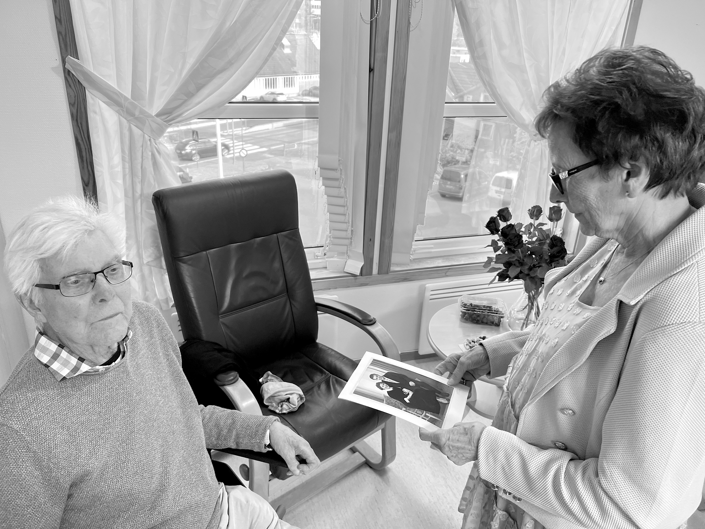
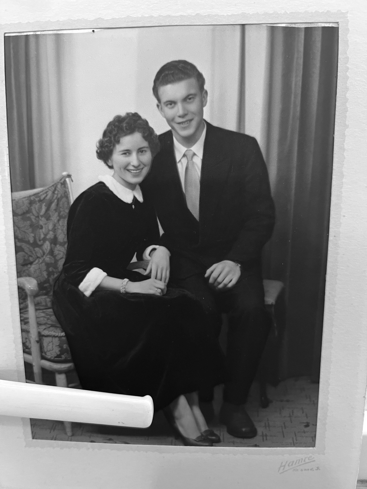

# TRAJECTORY

## Introduction

### Dedicated to my grandparents:
This book is dedicated to my grandparents, Roar Nodeland (17.07.1936 - 08.09.2023) and Bjørg Nodeland (15.08.1938 - 03.01.2025), whom I hold so dearly.
Thank you for all your love and support, providing me with stability, and with all your hard work ultimately extending to making all the opportunities throughout this book accessible to me. Your love contributed to giving me the dare and the will to try and approach the world head-first.

### Fading Memories
A quote I came across during my travels, in a visual neuroscience-lecture by Prof. Simon Cropper at the University of Melbourne, was Susan Sontag's statement that “existence is no more than the precarious attainment of relevance in an intensely mobile flux of past, present, and future” (Cioran, 1968, p. 7). I was later able to find the quote in the foreword of the book “The Temptation to Exist” by Emil Cioran.

Later, I came to realize how this quote touches on a very vulnerable and frail part of human existence. First, setting out on this whole journey, made it clear to me how the goodbyes, especially to my grandparents, very likely could be a final goodbye. And with my grandfather, it was.

I never set out to write a book while I was travelling -- I had too much on my mind at the time, and enough with just travelling -- I got back home, and realized nobody knows the experiences I went through, and maybe the most delicate part of it all; these memories are slipping away from me, already. Even if its just a few months, or years ago. Later on, if I get to grow old, I believe I would regret deeply not having written anything down regarding all these memories and experiences.

This was my life at its purest and most unfiltered - leaving was brutal, returning was brutal, but somehow that brutality created the most fertile ground for new beginnings, and for becoming whoever I'm supposed to be next.

### Format of the book
As of now, the format of the book seems to be something along the lines of Jack Kerouac, Hunter S. Thompson, Karl Ove Knausgård meets Dr. Reidar Wennesland. I guess we'll see where we end up.

### Music as a form of memory
Each chapter starts with a song that was central to that period of time.

### New Experiences
In psychology, therapy is sometimes viewed not only as a way of conciously reflecting upon experiences, but also as a space for new experiences. Let's say a person has rarely or never felt safe to express a certain emotion, or to actually experience that damage to a relationship is unavoidable, however, proper repair and accountability is critical for addressing and alleviating the strain. Although travel is not therapy, these new experiences did provide a more calibrated measure as to how I would like to live my life, and how I do not wish to live it. In that way, new experiences can be potent, as they show one way to do things, further highlighting subtle differences from previous experiences.

------------------------------

Writing Technique Recommendations

Scene construction: For pivotal moments (first arrival in Japan, significant cultural encounters), use the "show don't tell" approach with sensory details and dialogue
Reflection vs. experience ratio: Aim for roughly 70% experience/30% reflection to maintain narrative momentum
Cultural humility: Your observations about Akita's rural character show awareness of local context - continue this balanced perspective
Memory as theme: Since memory preservation is a stated motivation, consider occasionally addressing how memory works/fails throughout the narrative