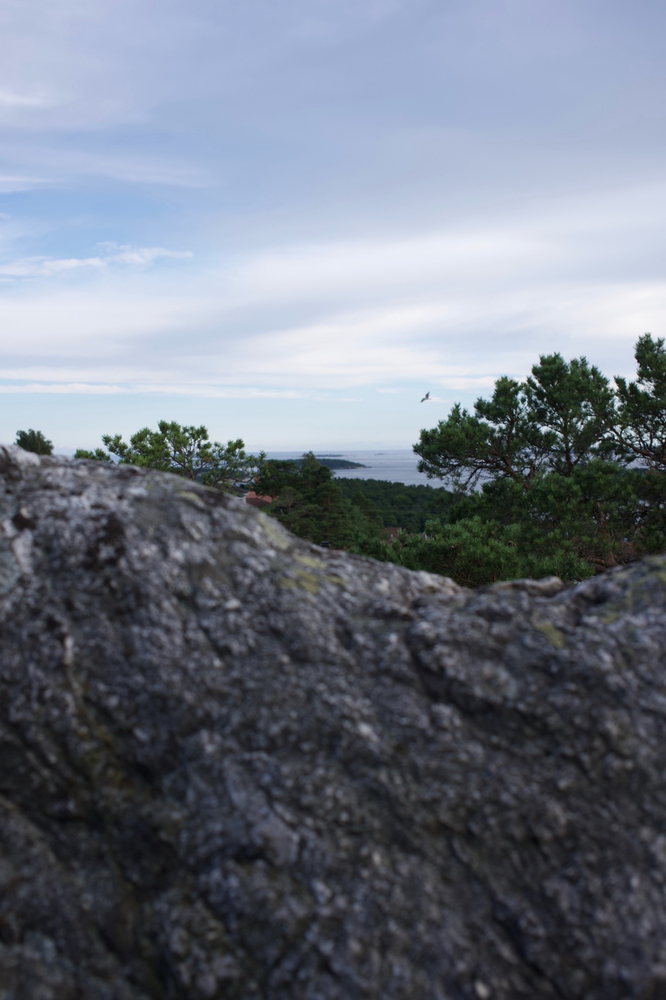

TRAJECTORY

This book is dedicated to my grandparents, Roar Nodeland (17.07.1936 - 08.09.2023) and Bjørg Nodeland (15.08.1938 - 03.01.2025), whom I hold so dearly.
Thank you for all your love and support, providing me with stability, and with all your hard work ultimately extending to making all the opportunities throughout this book accessible to me. Your love contributed to giving me the dare and the will to try and approach the world head-first.

