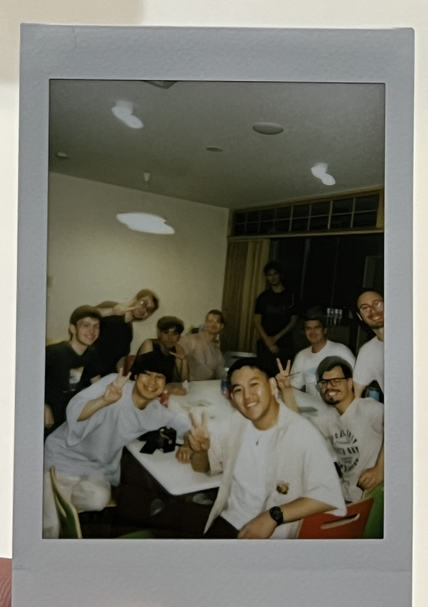
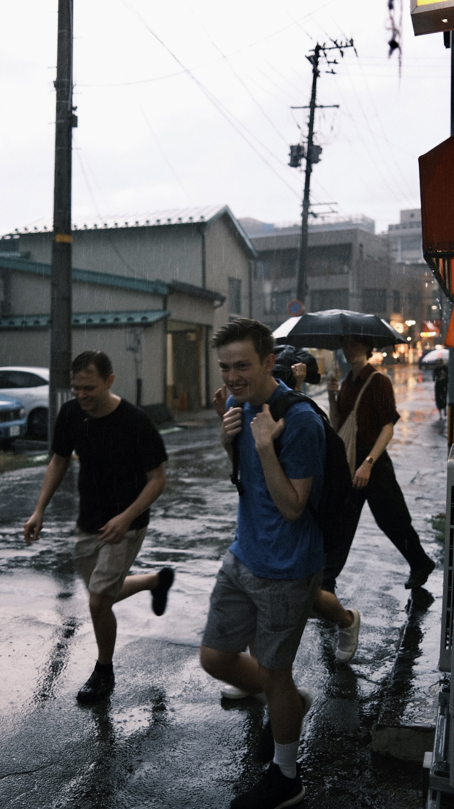
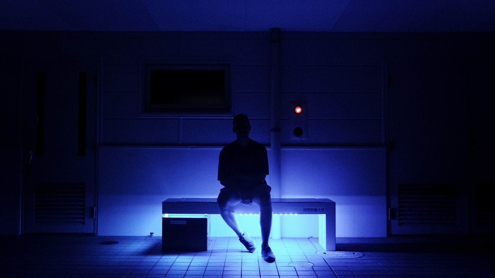
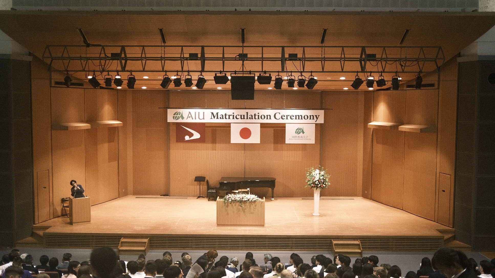
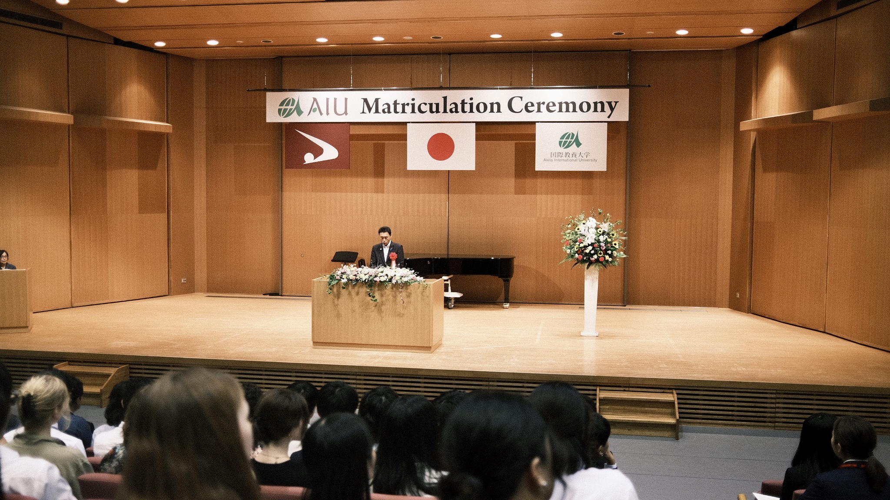
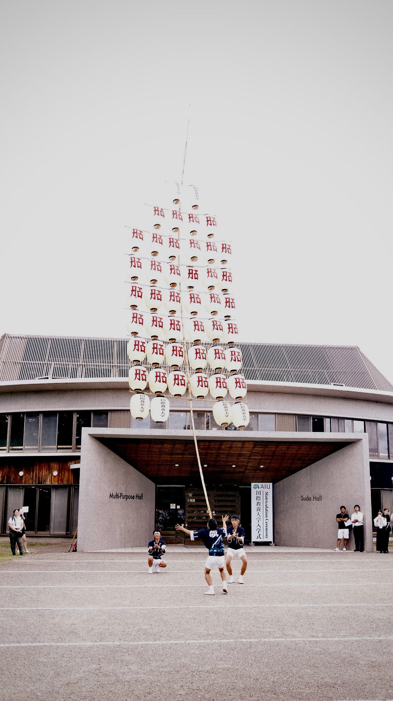
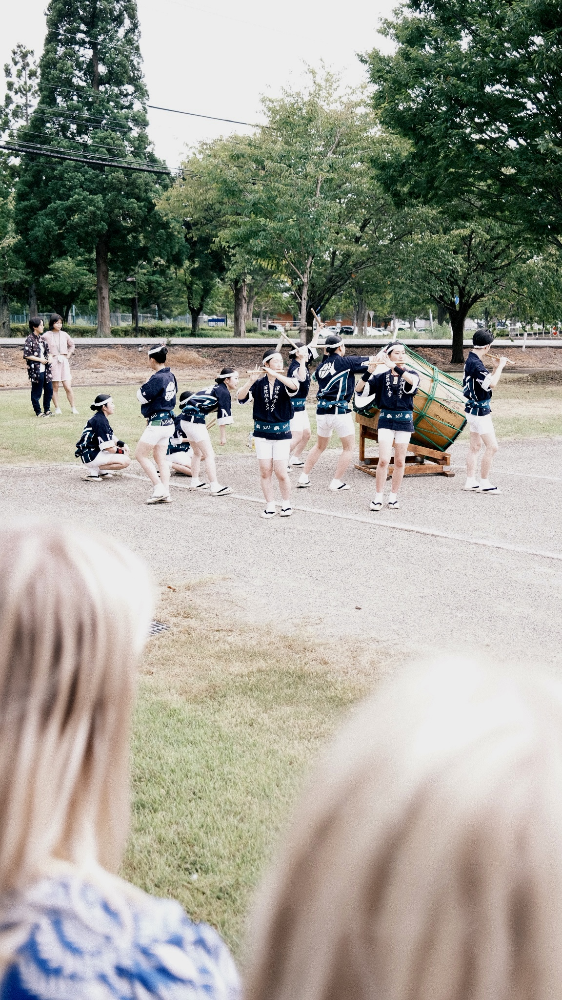

## Chapter 3: Rural Japan

### 24th August 2023:
Arriving in Akita

### 25th August 2023:
Akita

### 26th August 2023:
Morioka

### 27th August 2023:
Morioka

### 28th August 2023:

### Dinner in Akita City

Roger (Sweden), Owen (USA), Moss (Thailand), and Theodor (Norway) running in the rain in Akita City, during one of our first visits, looking for a dinner spot.

A picture of Antti (Finland) while waiting for the connecting bus between the nearest train station and our university.

### 1st September 2023

### Akita International University Matriculation Ceremony

### Kanto in Akita
The Akita Kantō (秋田竿燈まつり) is a Japanese festival celebrated from 3–7 August in Akita City, Akita Prefecture in hope for a good harvest. Around two hundred bamboo poles five to twelve metres long, bearing twenty-four or forty-six lanterns, topped with gohei, and weighing up to fifty kilograms, are carried through the streets by night on the palms, foreheads, shoulders, or lower backs of the celebrants.[1] The festival is first referred to in a[who?] travel diary of 1789 The Road Where the Snow Falls (雪の降る道).[1] It is one of the main festivals in Tōhoku, along with the Tanabata festival in Sendai, the Aomori Nebuta Matsuri festival, and the Yamagata Hanagasa Festival in Yamagata. The Akita Kantō festival was designated an Important Intangible Folk Cultural Property in 1980. (https://en.wikipedia.org/wiki/Akita_Kant%C5%8D)

