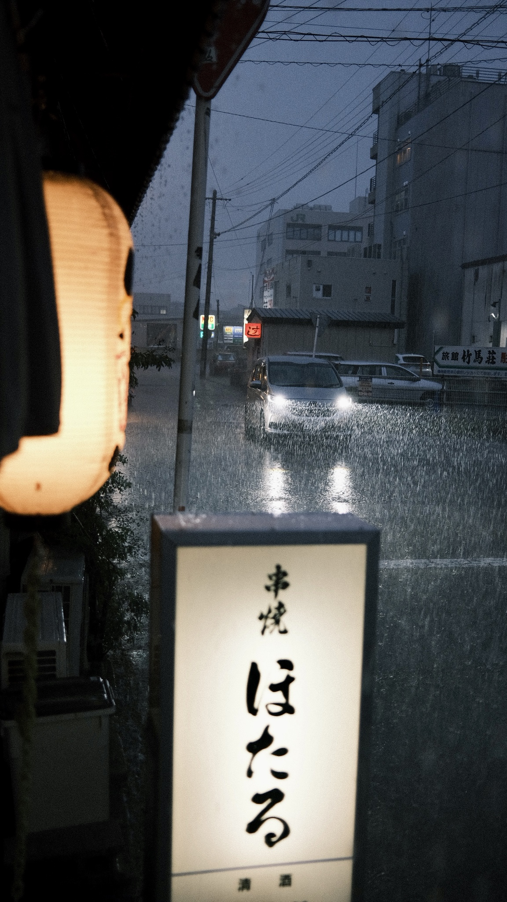
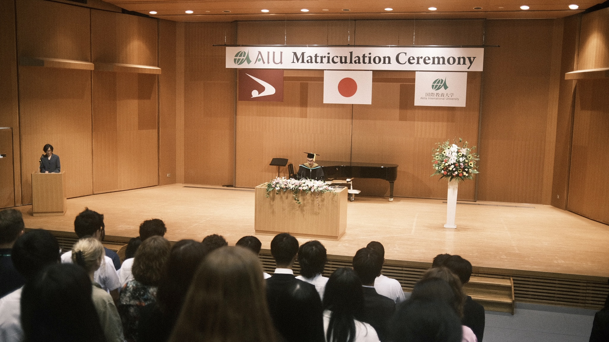

## Chapter 3: Rural Japan

### 24th August 2023:
Arriving in Akita

https://github.com/user-attachments/assets/28f69566-0568-4041-9f0a-31696ac790b1

### 25th August 2023:
Akita

### 26th August 2023:
Morioka

Mind you, I just got here. Akita is not some place I know like the back of my hand. Akita is the city in Northern Japan (a country I never visited in a continent I've never been before). I fucking got here to Akita on Thursday, today is Saturday. I'm already leaving again. Wosh wosh. Let's get outta here.

I say goodbye to my very new friends. I take the bus, pay with my physical suica card, I get to Wada station, slightly north of campus, now I have to take the train West, into Akita Station in downtown of Akita City, although Morioka is straight East. The shinkansen even goes through at Wada station, it just doesn't stop there tho. Akita City is probably the Japanese equivalent of Kristiansand and some other Norwegian city where you don't wanna live, (No disrespect to Akita), so finding the shinkansen is not too hard. I feel the sweat drip down on my forehead. No one ever told me Japan is this hot. I find the right platform, and the shinkansen arrives a few moments later. I get on it. Find a seat. I'm sitting on the left hand side, meaning, I'm staring north, and it's about 5-6 PM (CHECK!), so I get to see the beautiful light at dusk.

This sweaty, large Norwegian on the shinkansen. We're picking up speed. I feel so foreign. This is likely one of the first, but one of many moments I feel like this large, white being from the North. Every time I mention Norway, I hear people mention salmon and northern lights. I never thought about it that way. Also, I never miss Kristiansand or Oslo so far, I can only think about Svalbard. It reminds me of the most extreme sides of my country. The arctic. The polar environment. I learn that the Japanese word for polar bear is shirokuma (shiro = white, kuma = bear). This is what I feel like. I'm a large, white, foreign being in some distant place, where I'm not even sure I should be.

The rice fields and overgrown forests of Akita prefecture flashes at me, zap zap, the shinkansen travels fast, although the ride is a smooth one. Rice field after rice field, forests, signs with letters I don't recognize, flash flash, buildings with distinct Japanese features, zap zap, it all snags at me so hastily. And I see the sun go down somewhere in the middle of Akita and Morioka. Japan is cool and all. Like it's a cool experience for a vacation.  My overall feeling is mainly focused on; holy fuck -- I'm here. And I'm on my own. So fully, like, to an extent I've never ever been before. It's liberating. It's crushing. Who am I when no one else is around. I guess I'm about to find out.

- Soul Bamboo by Minoru Muraoka

On the shinkansen, I didn't actually listen to this song at the time, but this is what it felt like. When I travel I feel so fucking free. Or maybe not traveling. But being far away from home, and alone, and independent. I don't fully know what it is. I feel free from all the shit that I ever experienced in my hometown, the suffocation norms of Norway, and at the same time I feel trapped. I feel trapped because I'm broke, and I know I'm dependent on so much. Here, and so many other places, I hope to go back one time with more financial breathing room. I'm listening to "INTERLUDE 3" from BES's new album called "STANCE", which is the sole reason why I'm going to Morioka. 

I check in to my room quickly. No time to waste. A quick shower and change my shirt, and I go out. I decide to sit at the bar, and I'm eating and drinking alone. Probably one of my favorite activities. I can't decide on the food so I end up ordering both chicken wings and gyozas; walked in, but I'm rolling out. I have one, if not two beers.

I'm on this dark street. There's a small staircase a few floors down below ground floor. The walls are claustrophobically white. It's giving narrow slide at some nightmarish water park. This can't be the right place. I remind you, on a random dark street in Morioka, a Saturday in late August, I walk down these stairs. What the fuck have I gotten myself in to. At the bottom, there's a large black door; I can slightly hear some music behind it. I open it cautiously. Who woulda thought. There is Taiki, the guy I met together with Tikini in Shibuya. He greets me with a big smile. I pay some small cover charge and I walk in.

Okay. So what is this. There's a bar on the right. On the left there's some seating and a few low tables up against the wall. Straight forward is a small stage. The place is not crowded at all. I'd say it's about 10-15 people in here. They're playing some hip hop, and its great tho. There's multiple guys behind the mixers. Some people are smoking inside, like this basement needed to come off as even more hazy and dark than it already is. I guess its part of the experience tho.

I hear some guys speak American on my left. Clearly military. We later talk and I get to hear that they're from a base in Aomori. Air Force, they say. We have the usual Norwegian-American conversation about Norwegian beer prices, healthcare, and some talk about political systems. I don't remember it too well, and to be honest, lets skip the rest of this.

I walk further in the room, and I see Tikini busy by the stage and the turntables. I've already bought a beer, an asahi, and walk up to the stage. He greets me and gives me dap. He mentions that he didn't think he'd see me here. That I'd actually show up. I'm not really surprised myself. My whole life is just me getting lead astray and ending up in the weirdest places you've heard about. I love it tho. Any way, he introduces me to a few people. Some music guy from Tokyo.

Tikini buys a shot for me and a couple of other guys. 

Last shot of today

### 27th August 2023:
Morioka

### 28th August 2023:

### Dinner in Akita City

Waiting at Wada station

Roger (Sweden), Owen (USA), Moss (Thailand), and Theodor (Norway) running in the rain in Akita City, during one of our first visits, looking for a dinner spot.

A picture of Antti (Finland) while waiting for the connecting bus between the nearest train station and our university.

### 1st September 2023

### Akita International University Matriculation Ceremony

### Kanto in Akita
The Akita Kantō (秋田竿燈まつり) is a Japanese festival celebrated from 3–7 August in Akita City, Akita Prefecture in hope for a good harvest. Around two hundred bamboo poles five to twelve metres long, bearing twenty-four or forty-six lanterns, topped with gohei, and weighing up to fifty kilograms, are carried through the streets by night on the palms, foreheads, shoulders, or lower backs of the celebrants.[1] The festival is first referred to in a[who?] travel diary of 1789 The Road Where the Snow Falls (雪の降る道).[1] It is one of the main festivals in Tōhoku, along with the Tanabata festival in Sendai, the Aomori Nebuta Matsuri festival, and the Yamagata Hanagasa Festival in Yamagata. The Akita Kantō festival was designated an Important Intangible Folk Cultural Property in 1980. (https://en.wikipedia.org/wiki/Akita_Kant%C5%8D)

### Sept 2nd

### Nikaho, 22 september:

