## Chapter 4: Travelling in Japan

### 22nd September 2023
Nikaho

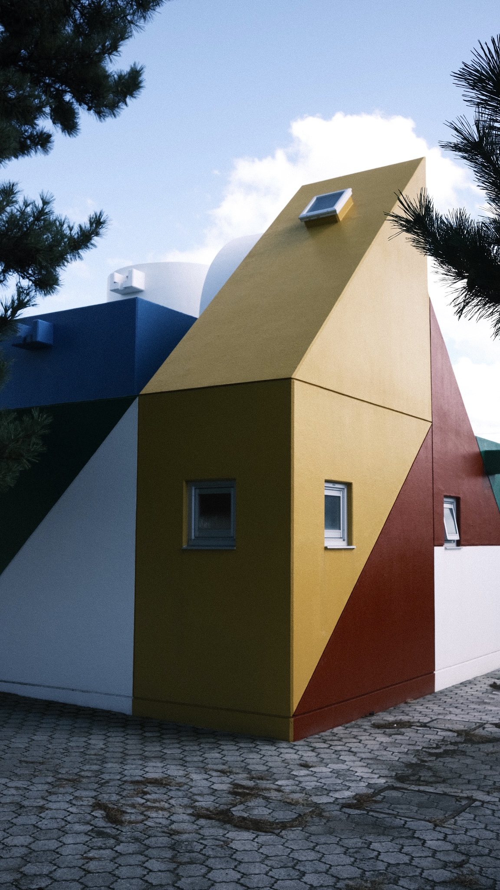

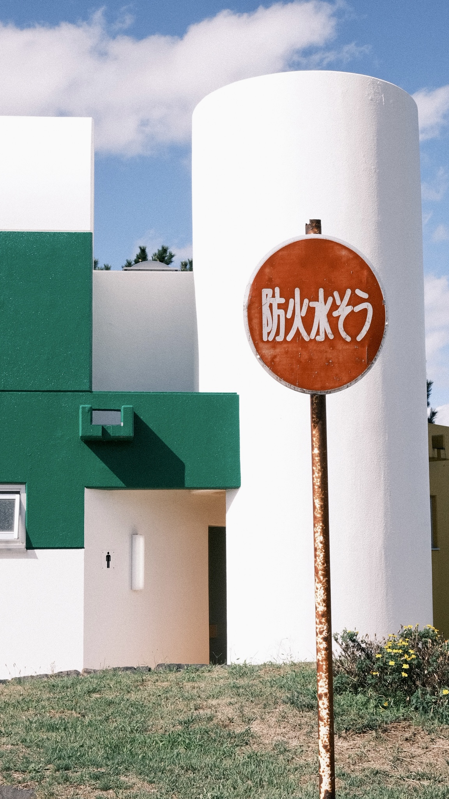

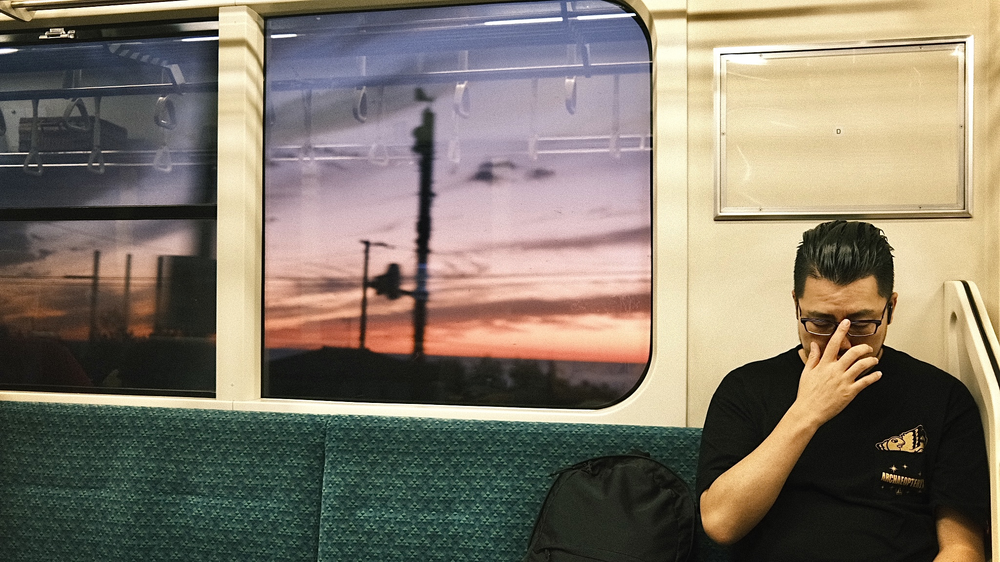

### 22nd September 2023
Bus trip to Oga Peninsula

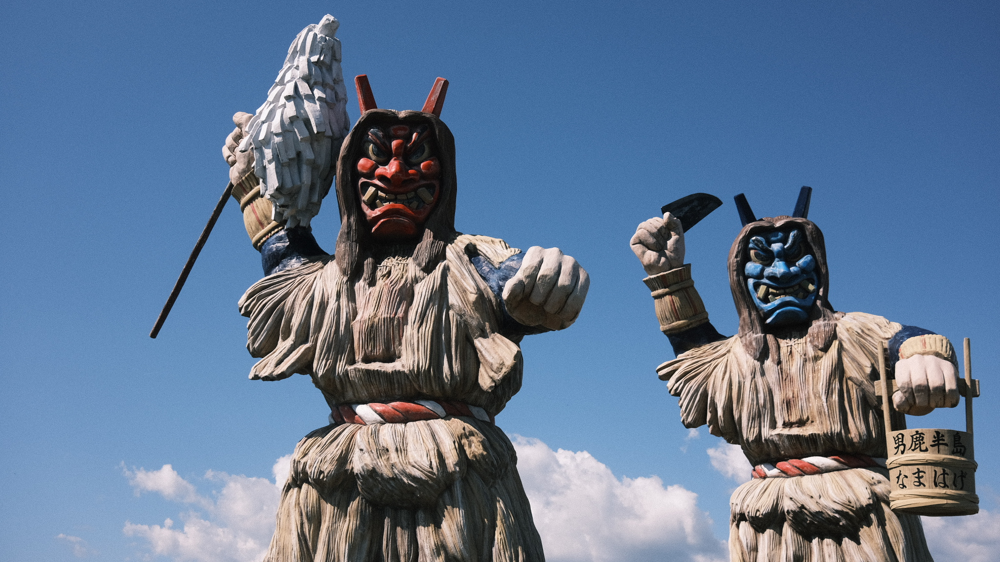

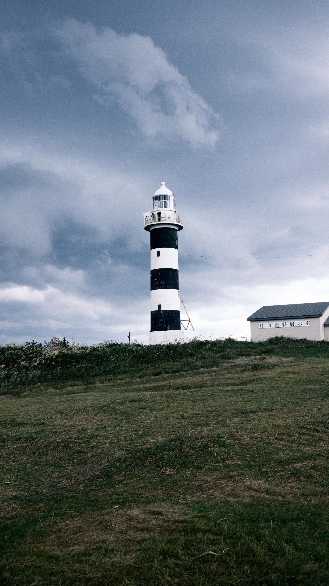

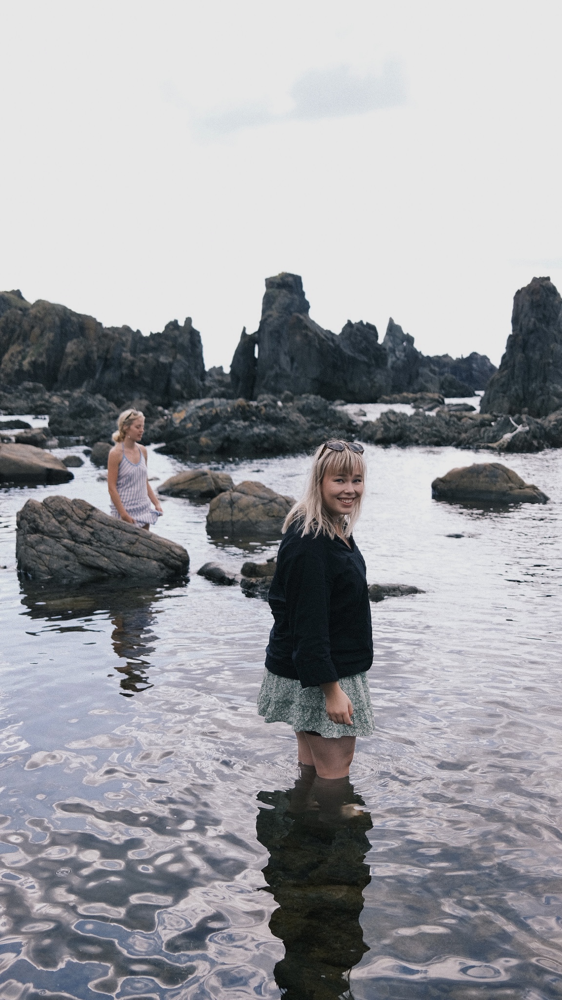

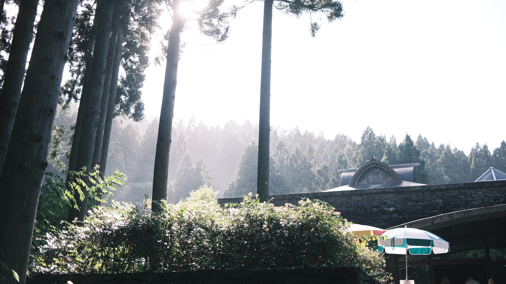

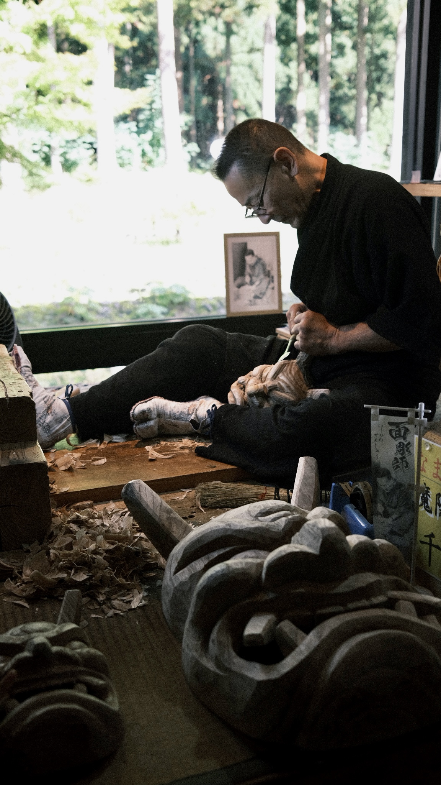

### 28th September 2023
Sendai

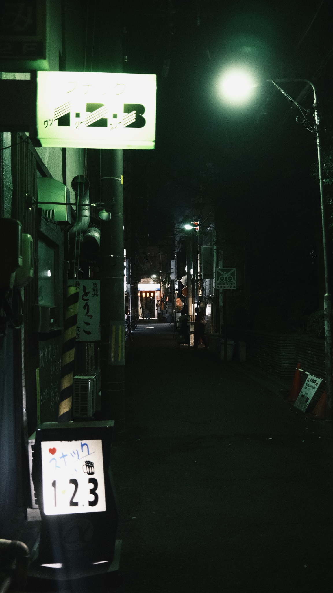

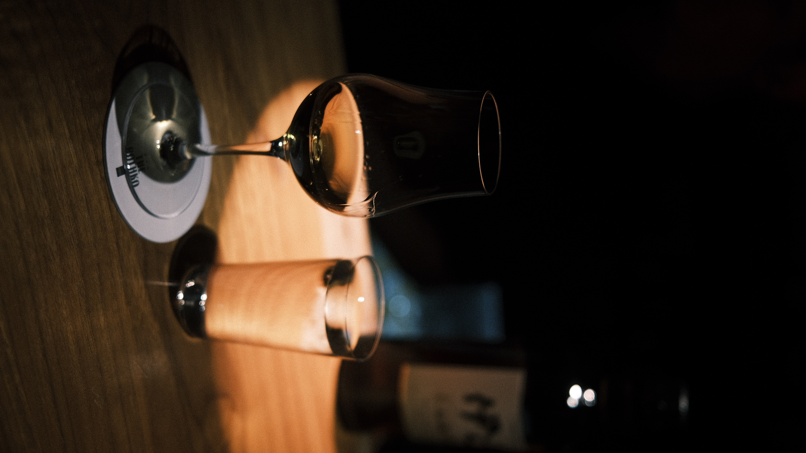

### 29th September 2023
Sendai

### 30th September 2023
Sendai

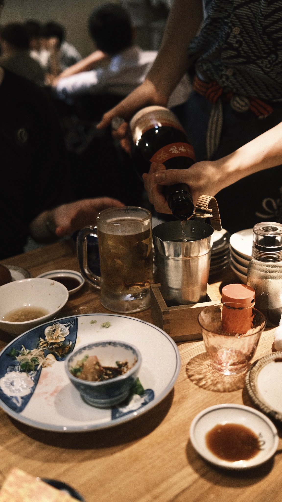

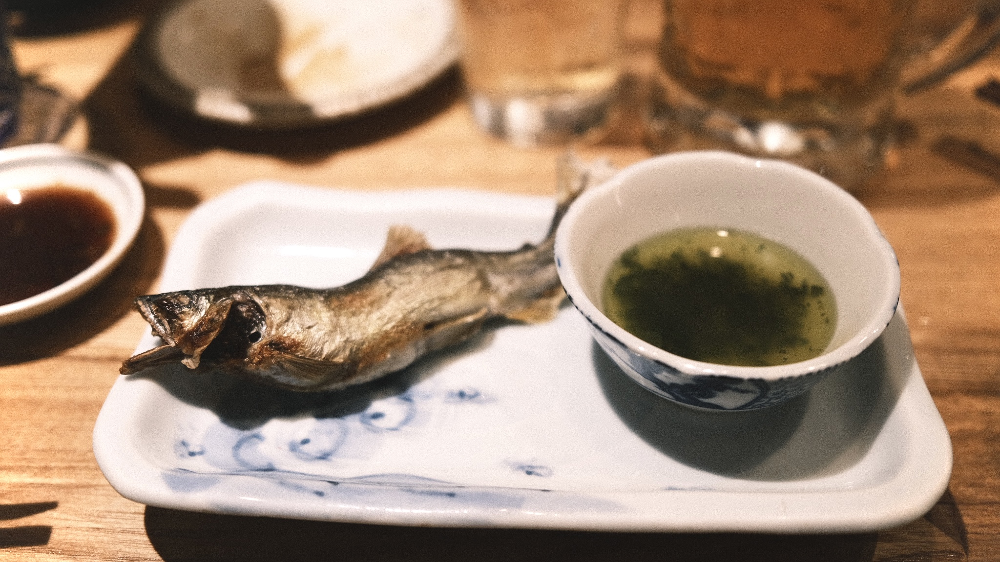

### 1th October 2023
Sendai -> Akita

Sendai beef tongue

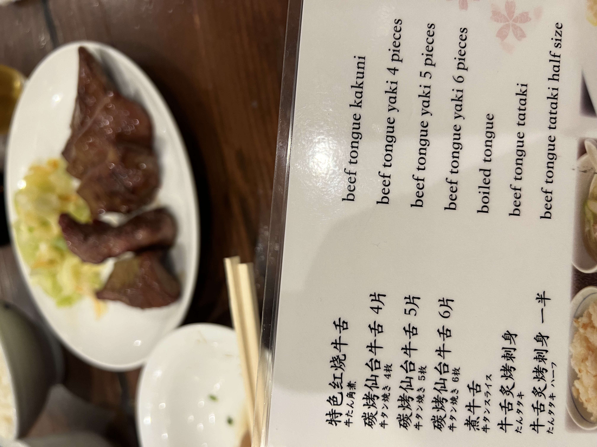

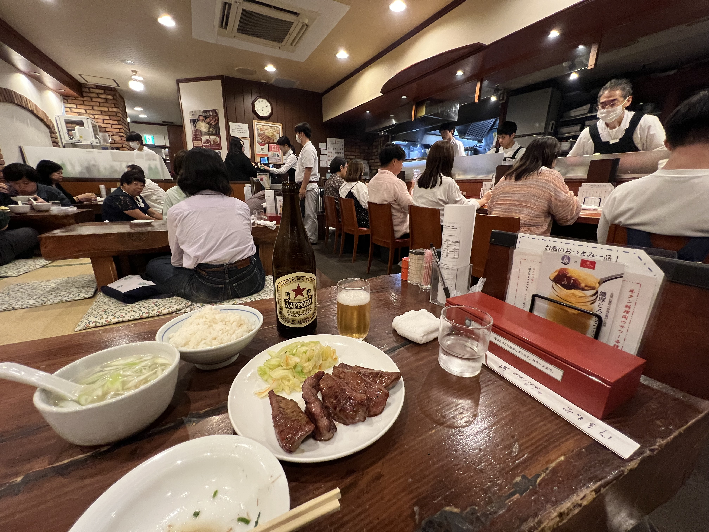

