## Chapter 7.2: Supportive Friends and Leaving Japan
Song: Remind me by Royksopp

### 23rd December 2023
- I fly to Tokyo. The sundown is fucking beautiful. I see the most of it, despite the woman in her lime green jacket constantly leaning in, and covering the window, to take pics as we approach Haneda Airport - my favorite airport in Tokyo.

### 24th December 2023
Owen and Antti in Shibuya

### 25th December 2023
Roppongi

### 26th December 2023
Roppongi

### 27th December 2023
Roppongi

Going to Yokohama to meet Misaki.

- I move 

### 28th December 2023
Kabukicho

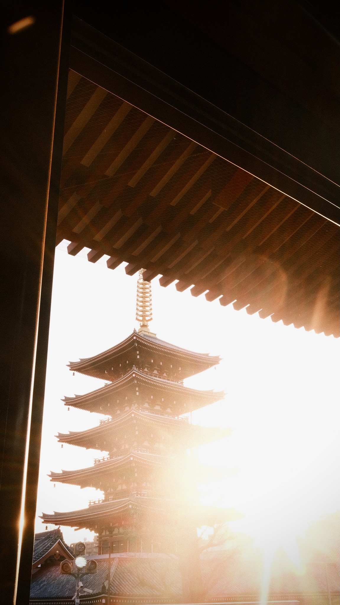

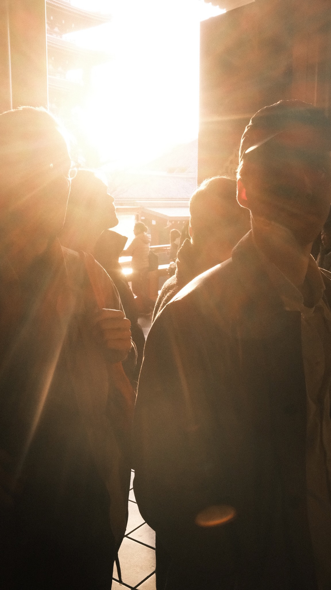

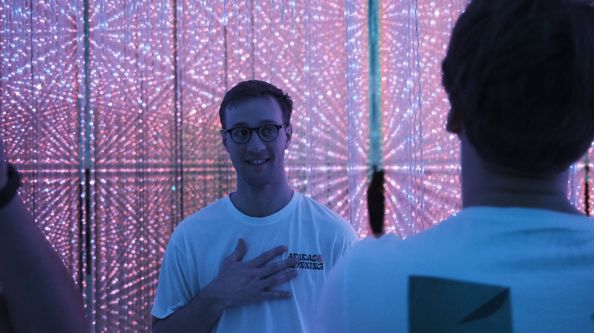

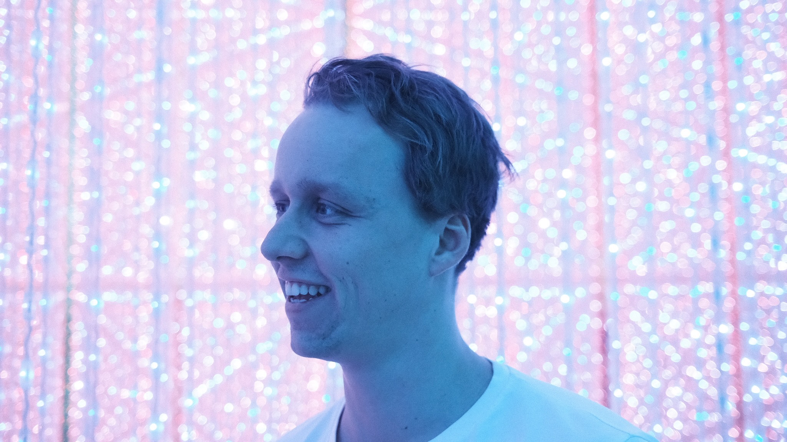

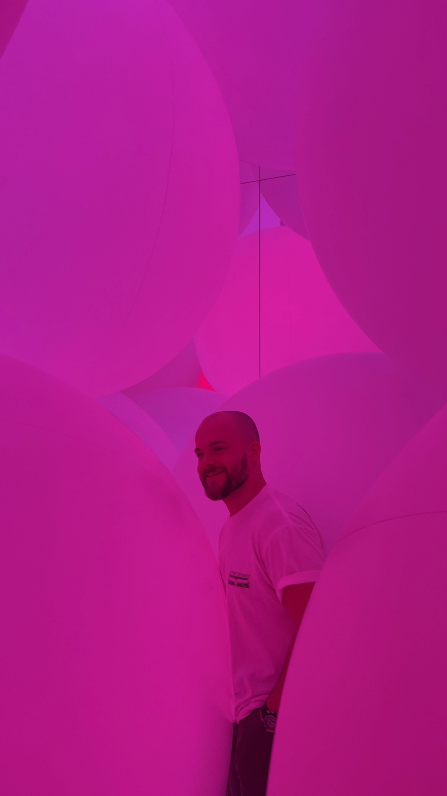

### 29th December 2023
Kabukicho

### 30th December 2023
Kabukicho

### 31th December 2023
Kabukicho

#### Written on the 31st December 2023:
"It’s already been a few weeks of goodbyes. And  I have now entered my last week in Japan — for now.

I’ve met so many people that I will miss, and there’s so many places I would like to go back to. And yet so much more to discover.

I often get the feeling that I only borrowed all these experiences, and that they are too great to stay with me for the rest of my life. But they will. And I’m deeply grateful for that.

I will remember this year as the year of friendships, smiles and receiving a lot of help and support. From new friends. From Japanese friends. And from my close friends and family in Norway. I wouldn’t have been able to do this on my own.

I’m the worlds luckiest man surrounded by great people. Thank you! And see you soon. Best wishes for 2024."

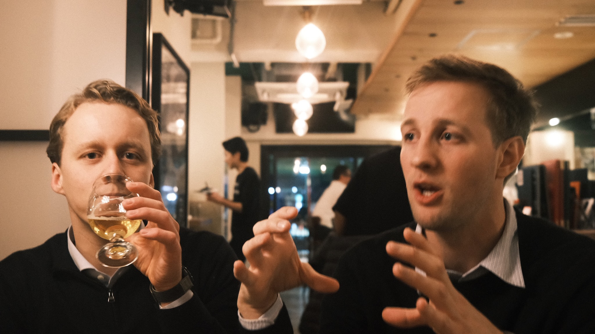

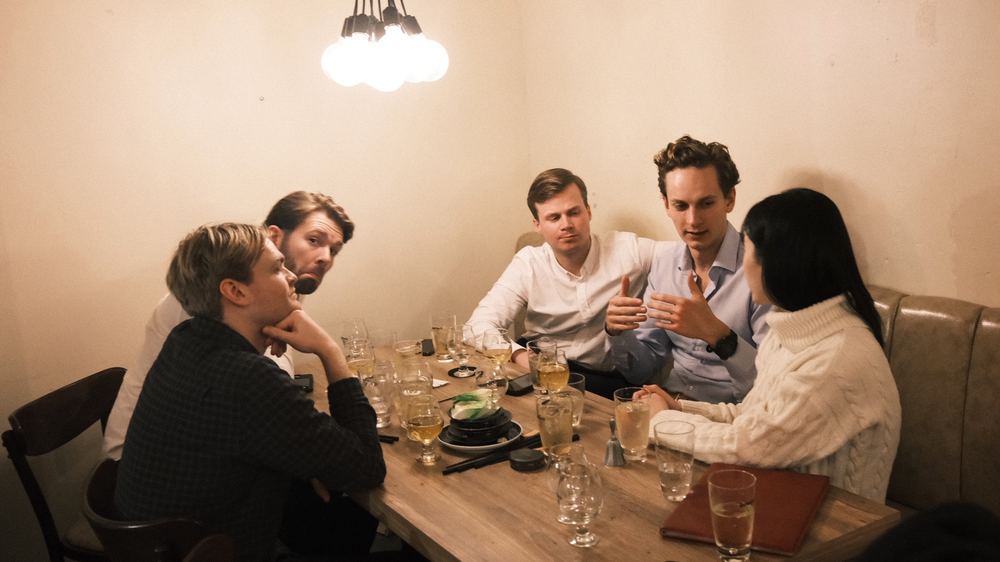

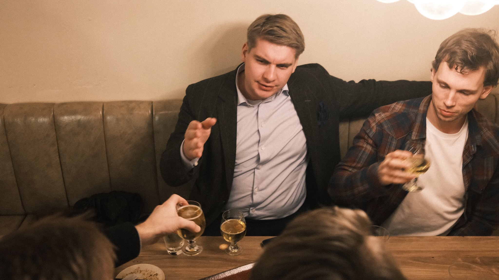

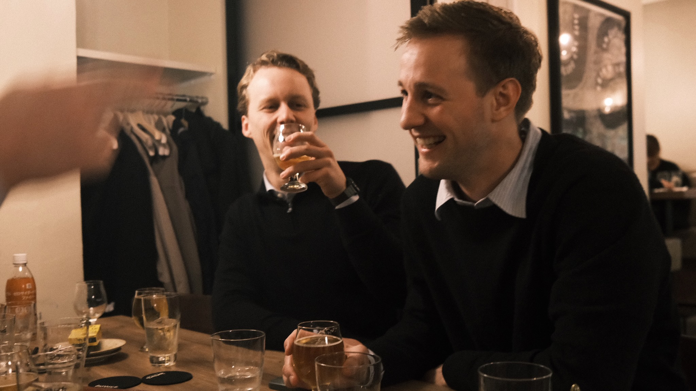

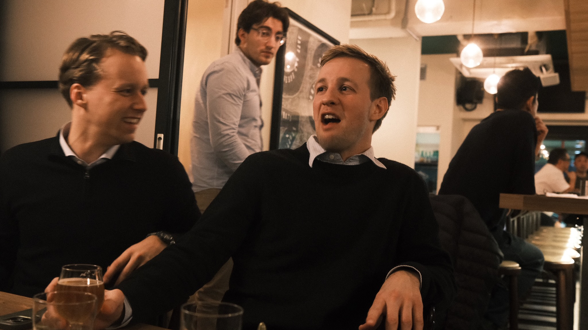

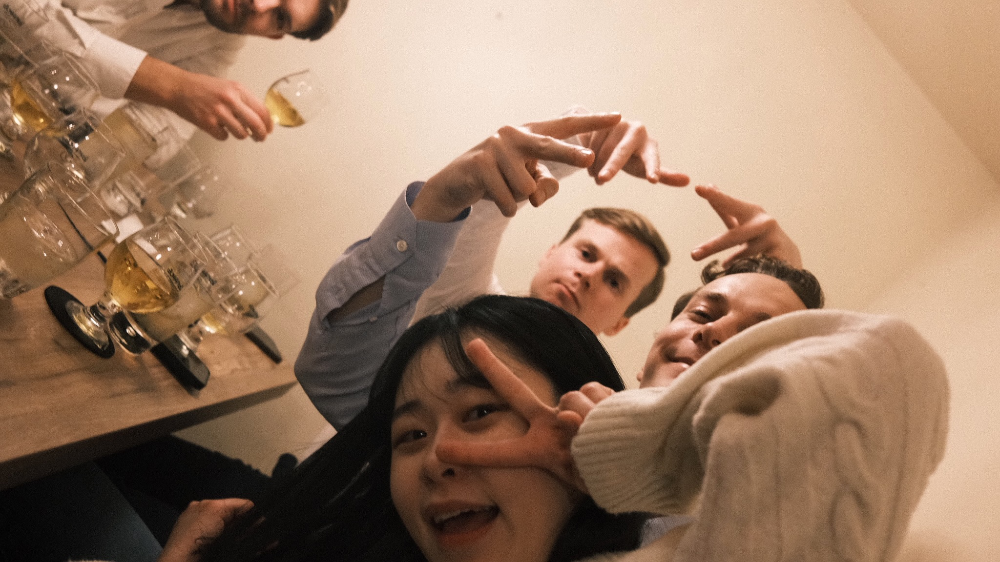

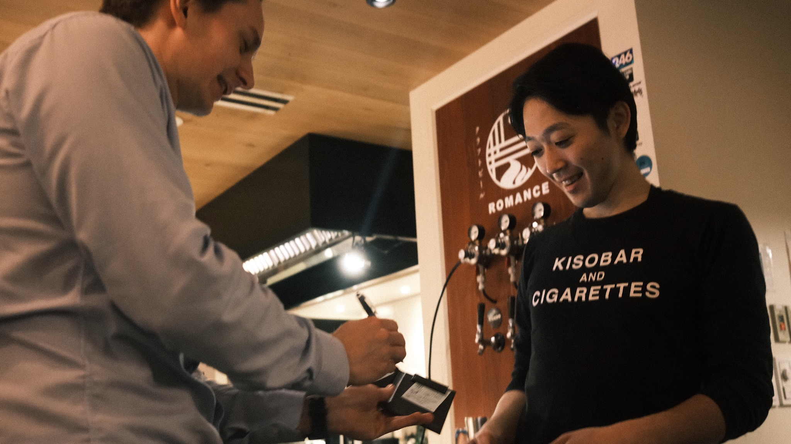

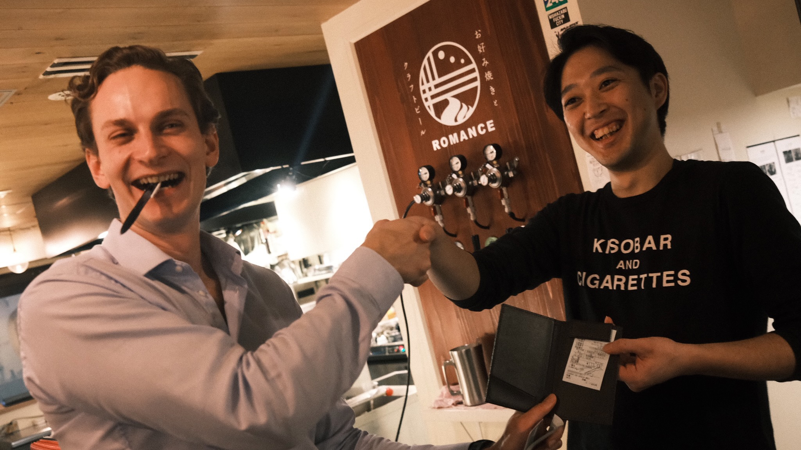

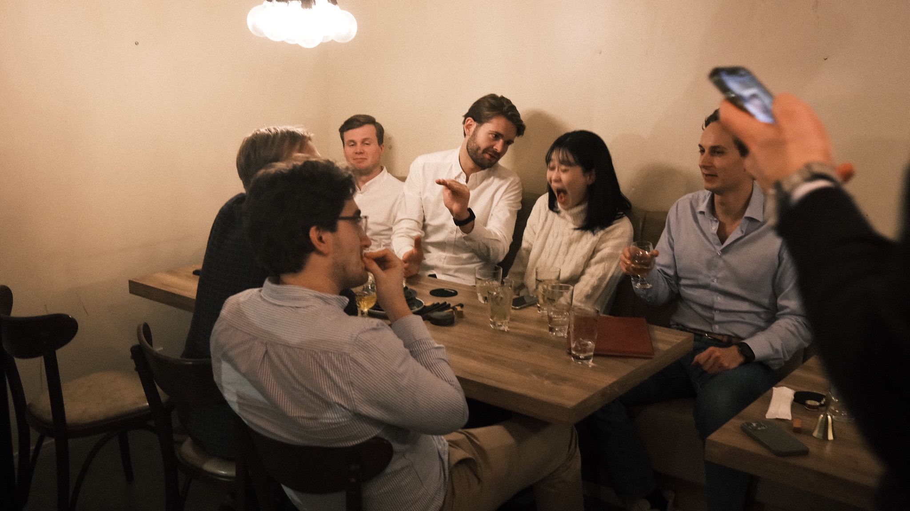

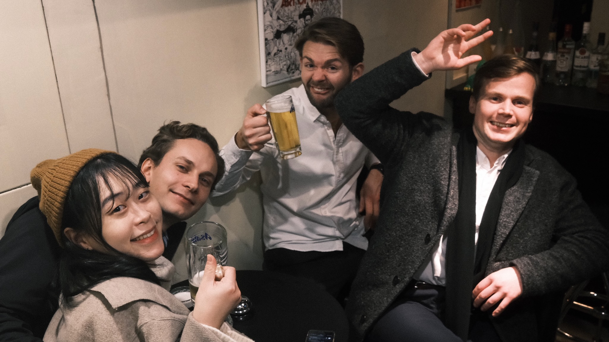

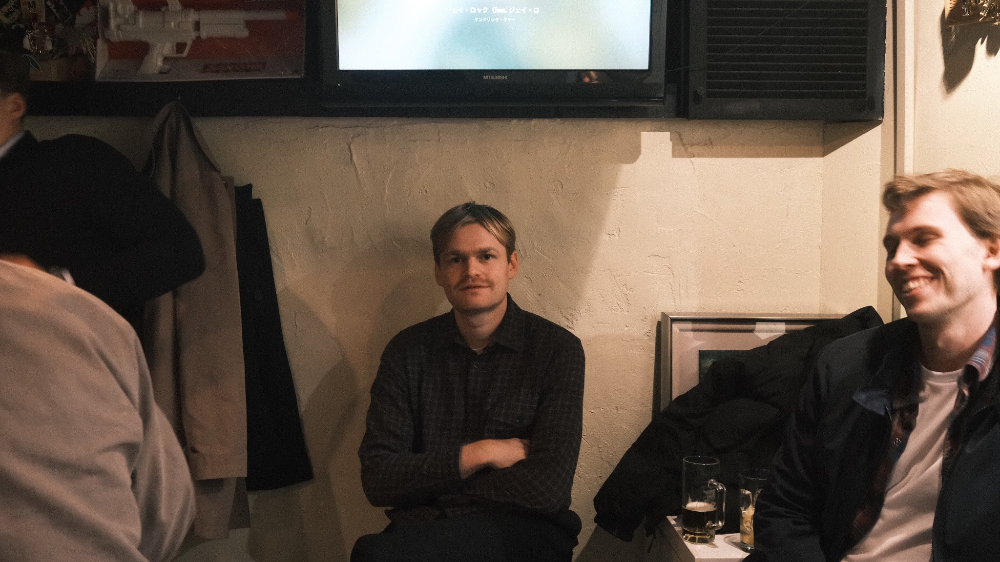

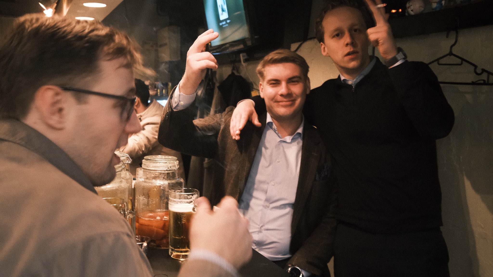

### 1st January 2024

### 2024 Noto Peninsula earthquake
On 1st January 2024 an Mw 7.5 earthquake occurred along an active fault across the Noto Peninsula. The hazards caused damage to buildings and infrastructure and more than 240 deaths. As usual, most casualties were caused by building collapse, but there was a high incidence of death by hypothermia and cold, which is different from the impact of the 2011 Great East Japan Earthquake and reflects the harsher winter climate of this Noto Peninsula. (Suppasri et al, 2024).

### 2nd January 2024

### 3rd January 2024

https://github.com/user-attachments/assets/7097a47b-727b-4a27-8d04-81482ced4312

### 4th January 2024

### 5th January 2024

I leave the karaoke at midnight, with my friends still going hard. These are some really great guys, and god damn it, I love them. My flight leaves earlier tomorrow, so while they have the day in Sapporo together, I've decided to fly earlier to Tokyo to meet up with Misaki.

----

Thematic Arc:
Setup: "I'm leaving everything I know"
Development: "I'm becoming someone new"
Climax: "I have to leave these people/places"
Resolution: "These experiences are already fading"
Conclusion: "I wrote it down, but I still can't hold onto it"
--

### 6th January 2024

My flight leaves Chitose Airport on the 6th January 2024 around 10:15.

I arrive by the airport express bus (check this?) in Shibuya around 2:30 pm, it's just a five-six minute walk to the capsule hotel for the last evening in Tokyo, and for this part of the adventure. I relax for a few hours in the hotel.

I walk out from the hotel at 19:00. I'm slowly walking toward the busy, tourist-buzzing part of Shibuya. I meet Misaki at ... . We go toward 35 steps bistro, it's up Shóto Bunkamura Street, and left, then you're basically there. It's on the right side. And then you can (!) miss it. There's a small grey, not very distinct, staircase leading down to the bistro. We walk down these spiraling stairs and get down to the bottom. It's warm, feels welcoming, and it smells like food.

Almost all the tables are taken, so I'm thinking we might not get a table tonight. Misaki speaks Japanese with the guy receiving us at the entrance. To my surprise, after some Japanese convo going back and forth; Misaki tells me that they have a spot at the bar in a minute. Little Henrik should have known about moments like these. His (my) only reference to Tokyo and Japan as a child was fucking Tokyo Drift, like the movie. It's likely to be the best Fast and the Furious movie, but it's still a Fast and the Furious movie, I mean, it's equivalent to the old; a monkey in a suit is still a monkey. Not likely to be an accurate cultural analysis of Japan. And HAN, he's not even Japanese?! One of the coolest characters from that movie, basically the second guy I remembered, he's South Korean, and even more embarrassing, I'm mid-twenties before I realize it.

Anyway, I'm in Tokyo. I've been in Japan for five months now, can you believe it? Like actually for a sec imagine that. People ramble to me about their ten days in Tokyo, and possibly Osaka as a stretch too, depending on if they read up before going on their vacay. They tell me about all that they've experienced, and how overwhelming it as. I'm not gonna argue, I can see that.  But me. Fuck me. I've been living in the fucking country side of Japan; likely something equivalent as going to Norway on exchange but staying in fucking Brønnøysund or something. But I'm here tho, and we just got a spot at this crowded place. HAI says the waiter, he smiles and starts walking us over to our spot. I'm following Misaki, Misaki follows the waiter.

I'm feeling kinda proud, and this is all somewhat surreal. It's early January, a new year, new beginnings. But I don't want this to end. But tomorrow actually is a new beginning, I hope. Or, all I'll know tomorrow is the end of this. I try to suppress these emotions. I'd rather focus on the logistics of it, the packing, the weight of each bag, the evaluation of whether I'll need this or that in Australia, or whether to send some random physical object back to Norway together with all my friends. We walk across the room; it's on the other end of the bar. But yes. Proud. Little Henrik should have known he'd be in some basement bistro in Shibuya with a beautiful woman one day. In the rooftop scene with Han and Sean, where they have a deep talk (as deep as talks get in a fast and furious movie). They're on a rooftop in Shibuya. I always remembered that scene well because of the rooftop soccer field in the middle of the city, overlooking Shibuya crossing. Anyway, Han ends it by saying "life's simple, you make choices and you don't look back". I'm not sure I agree tho. That logic probably works great in a car movie script. But I'm here. And right now, it doesn't feel like I have much of a choice. And, I'm definitely looking back at it. Life is not simple.

At 19:41 we sit down by the bar in 

I remember her blonde hair, her pranging jewelry against her glittering grey top. It's not too much or over the top. She looks beautiful. And I also see her quite recent tattoo. Which is not too much of a common sight on a Japanese person, none the less a woman. She definitely has a distinctive style, and I think it's a great one.

She orders a drink, it comes in Sapporo-something-glass. We also have starters, what was it again? We eat torched mackerel for main course.

I believe we both didn't want to end the night there. At the same time, we were both aware that time was running out. In hours, not days, but hours, I would leave Japan, I would leave the continent, and I had no clue if or when I would be back.

So, I guess we were both looking for a place, a physical excuse as to not yet end the evening, and also in a more private setting. We sit down on some random staircase in Shibuya, just across the street from Cerulean Tower Tokyu Hotel. The stairs are right by to some car road, just a slight turn around the corner from bars, busy streets, high balls, and dirty streets.

The stairs are in some white tile pattern with grey cracks in them. We decide to sit down here. Such a horrible spot, but it's the best we can do right now. Remember, it's January. While it's not as bad as Norway; it's definitely crisp. I put my right arm around her, and I can now see that she is visibly sad. Her eyes are watering, although in a very quiet way. To be fair, I didn't know that she actually cared much for me at all. But tonight has been a great evening tho. Like, I'm surprised about it. About the moment, there is something incredibly fragile and vulnerable in a moment like this. I'm not sure how to put my finger on it. 

Last night in Tokyo. Right there, while running for the last subway for the night at Shibuya station, she turned around, and she looked at me from the inside of the train station gate; "daisuki desu!" ... "Henrik, I love you!".

I remember the feeling as surreal, but also damning, in the sense that the underlying condition of all these travels is how fleeting all these moments and interactions are. And there is little you can do to help it.

I didn’t know what to say. What I remember most vividly is walking out of the station, toward the capsule hotel, where all my friends would soon arrive.

Nine large Norwegians in nine too small capsules.
